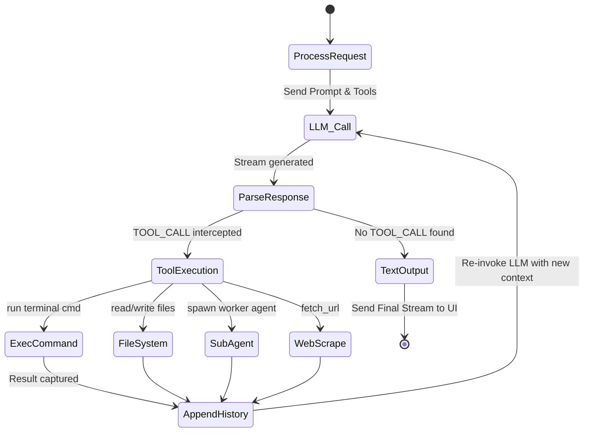

<div align="center">
  
  <h1>🐱 MEOW CODE</h1>
  <p><b>One workspace. Every AI. Your data, your rules.</b></p>
  <p>
    
    
    
    
  </p>
  <p>
    <i>Meow Code is a privacy-first, unified AI workspace where authorized AI providers become interchangeable workers behind one persistent project, memory, tool, connector, agent, and workflow layer.</i>
  </p>
</div>

---

## 🌟 The Vision

Every day, builders jump between five different AI tabs — one for coding, one for research, one for images, one for "the model that's actually good at this specific thing." Each tab forgets everything the moment you close it. None of them know what the others just did.

**Meow Code** doesn't replace those models. It **orchestrates** them — behind one continuous interface, with one persistent memory, one project state, and an **uncompromising privacy-first architecture** that treats your credentials and your work as yours by default.

### 🛡️ The Three Laws of Meow

1. **Meow owns the workspace, not your AI credentials.** (100% Stateless backend).
2. **Memory belongs to your project, not to a single AI session.**
3. **Orchestration stays out of the hot path** — so Meow feels as fast and native as talking to the provider directly.

---

## 🚀 God-Tier Features

Meow Code has evolved far beyond a standard AI wrapper. It is a fully autonomous, sandboxed, multi-agent operating system.

### 1. 🤖 Multi-Agent Orchestration (`spawn_subagent`)
When you assign Meow a massive task, it doesn't just try to answer in one go. The main agent can **spawn recursive background subagents**, passing them explicit tool access and goals. 
- Subagents execute isolated reasoning loops up to a depth of 5 to prevent infinite runaway.
- They utilize the exact same filesystem and shell tools as the primary agent.
- The UI seamlessly pauses the main stream, waits for the background worker to finish, and streams the synthesized result.

### 2. ⚡ Live Artifact Rendering (Interactive Previews)
Why copy and paste code when you can see it? Meow intercepts any generated `HTML` or `SVG` block and provides a **Live Preview** toggle button.
- **Sandboxed Execution**: Code runs inside a securely constrained `iframe` (`sandbox="allow-scripts allow-forms allow-same-origin allow-popups"`).
- **Rapid Prototyping**: Tell Meow to *"Build a React-style tic-tac-toe game in a single HTML file"* and literally play it inside the chat UI seconds later.

### 3. 🌐 Native Internet & RAG (`fetch_url`)
Meow doesn't hallucinate APIs. Armed with the `fetch_url` tool, the agent can natively fetch documentation, crawl sites, and ingest live data directly into its context window on demand. 
- It bypasses standard LLM training cut-offs by actively researching modern libraries mid-conversation.

### 4. 🎛️ Real-Time Telemetry & Transparency
Enterprise AI requires trust. Meow Code features a beautiful **Telemetry UI**. 
- Whenever the agent thinks, uses a tool, or spawns a subagent, the frontend renders pulsating status badges (`🤖 Running Tool...`, `✅ Tool Output`).
- You can watch the exact bash commands, file modifications, and web scraping operations the AI is performing in real-time.

### 5. 🧠 Prompt Overrides & Planners
By typing `/plan` before your prompt, you can force the AI into an architectural mindset. The frontend dynamically intercepts this slash command, injecting a stealth system prompt that forces the LLM to output a meticulous Markdown checklist rather than jumping straight into code.

---

## 🏗️ The Agent Bridge (Recursive State Machine)

The true power of Meow Code lies in the backend **Agent Bridge**. Instead of just returning text, the Fastify server intercepts JSON tool commands and acts as an autonomous execution engine on your local machine.



### God Mode Tool Reference
| Tool Identifier | Capability & Security Scope |
|-----------------|-----------------------------|
| `execute_command` | Full terminal access. Executes shell commands (npm, git, bash) locally. |
| `read_file` | Read the exact state of your local codebase files to prevent blind edits. |
| `write_file` | Scaffold new applications, config files, and components instantly. |
| `append_file` | Add lines to logs or `.env` files safely. |
| `replace_file_content` | Precision patching. Replaces specific strings to avoid rewriting entire files. |
| `list_dir` | Directory traversal to understand the structure of the project. |
| `fetch_url` | Web scraping and documentation ingestion. |
| `spawn_subagent` | **Parallel background workers** that share the exact same toolset. |

---

## 🔒 100% Stateless Security Architecture

Most AI platforms store your API keys and chat logs in their cloud databases, creating massive Honeypots for hackers. **Meow Code does not.**

### How We Secure Your Data:
1. **IndexedDB Local Vault**: API Keys (OpenAI, Anthropic) are saved securely in your browser's IndexedDB via `idb-keyval`. They are never passed through URL parameters or `localStorage` (which is highly vulnerable to XSS).
2. **The `x-provider-keys` Header**: When you send a message, the React frontend injects your API keys into a custom HTTP header.
3. **The Ephemeral Backend**: The Node.js Fastify server receives the header, decodes the keys in-memory, executes the LLM call, and instantly destroys the memory reference. **There is no database attached to the API.**
4. **Sandboxed Artifacts**: All generated UI components are rendered inside a heavily restricted `iframe` to prevent malicious code generated by the AI from escaping into the parent DOM.

---

## 📁 Monorepo Structure

Meow Code is built as a highly modular `npm workspace` monorepo.

```text
MEOWCODE/
├── apps/
│   ├── api/                 # Fastify backend (Agent Bridge, Orchestrator)
│   ├── cli/                 # Terminal interface (Coming soon)
│   └── web/                 # Next.js 15 Frontend (Chat UI, Telemetry, Artifacts)
├── packages/
│   ├── auth/                # Stateless Authentication utilities
│   ├── database/            # Local SQLite schema definitions
│   ├── providers/           # Multi-LLM SDK wrappers
│   ├── router/              # AI Model Routing logic
│   ├── sdk/                 # Internal API definitions
│   ├── shared/              # Shared TypeScript types
│   └── ui/                  # Radix-UI + Tailwind component library
└── package.json
```

---

## 🎯 Showcase Scenarios

If you are pitching or demonstrating Meow Code, try these exact workflows to showcase its power:

### Scenario A: The Autonomous Developer
1. **Prompt**: *"Look at the files in `./apps/web/app/components`. Find the `Header.tsx` file and change the background color from black to zinc-900."*
2. **Watch it work**: You will see the Telemetry UI flash cyan as it calls `list_dir`, then `read_file`, and finally `replace_file_content`. It acts completely autonomously without you writing a single line of code.

### Scenario B: The Live Interactive UI
1. **Prompt**: *"Write a complete, single-file HTML implementation of Conway's Game of Life. Make it look beautiful with CSS."*
2. **Watch it work**: Once the AI finishes streaming the code block, click **Live Preview** in the top right of the code block. The game will render and run directly inside your chat window.

### Scenario C: The Advanced Researcher
1. **Prompt**: *"Use fetch_url to read https://raw.githubusercontent.com/fastify/fastify/main/README.md and summarize their core philosophy."*
2. **Watch it work**: Meow Code will reach out to the live internet, ingest the massive markdown file, and respond with exact, up-to-date facts.

---

## 💻 Getting Started

### Prerequisites
- Node.js (v18+)
- npm (v9+)

### 1. Install Dependencies
From the root of the monorepo, install all workspace packages:
```bash
npm install
```

### 2. Run the Development Server
This will concurrently boot the Next.js frontend and the Fastify backend:
```bash
npm run dev
```

### 3. Build for Production
To compile the TypeScript project and build the optimized Next.js bundle:
```bash
npm run build
```

The Web UI will be available at `http://localhost:3000` and the API layer at `http://localhost:4000`.

---

## 🤝 Contributing & Extending Tools

To add a new tool to the AI's God-Mode arsenal:
1. Open `apps/api/src/routes/chats.ts`.
2. Add your tool signature to the `AGENT_TOOLS` system prompt string.
3. Implement the execution logic inside the `executeTool()` function.
4. The LLM will automatically understand and utilize your new capability natively.

---

<div align="center">
  <p><i>Built for builders who refuse to compromise on power or privacy.</i></p>
</div>
