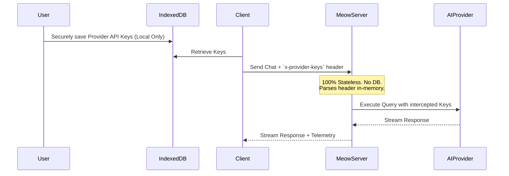

<div align="center">
  <h1>🐱 MEOW CODE</h1>
  <p><b>One workspace. Every AI. Your data, your rules.</b></p>
  <p>
    
    
    
  </p>
  <p>
    <i>Meow Code is a privacy-first, unified AI workspace where authorized AI providers become interchangeable workers behind one persistent project, memory, tool, connector, agent, and workflow layer.</i>
  </p>
</div>

---

## 🌟 The Vision

Every day, builders jump between five different AI tabs — one for coding, one for research, one for images, one for "the model that's actually good at this specific thing." Each tab forgets everything the moment you close it. None of them know what the others just did.

**Meow Code** doesn't replace those models. It **orchestrates** them — behind one continuous interface, with one persistent memory, one project state, and an **uncompromising privacy-first architecture** that treats your credentials and your work as yours by default.

### 🛡️ The Three Laws of Meow

1. **Meow owns the workspace, not your AI credentials.** (100% Stateless backend).
2. **Memory belongs to your project, not to a single AI session.**
3. **Orchestration stays out of the hot path** — so Meow feels as fast and native as talking to the provider directly.

---

## 🚀 God-Tier Features (Showcase Ready)

Meow Code has evolved far beyond a standard AI wrapper. It is a fully autonomous, sandboxed, multi-agent operating system.

### 1. 🤖 Multi-Agent Orchestration (`spawn_subagent`)
When you assign Meow a massive task, it doesn't just try to answer in one go. The main agent can **spawn recursive background subagents**, passing them explicit tool access and goals. Subagents do the heavy lifting in the background and report back to the main thread.

### 2. ⚡ Live Artifact Rendering
Why copy and paste code when you can see it? Meow intercepts any generated `HTML` or `SVG` block and gives you a **Live Preview** toggle. Clicking it spins up an isolated iframe directly inside the chat. Tell Meow to *"Build a calculator"* and use it instantly.

### 3. 🌐 Native Internet & RAG (`fetch_url`)
Meow doesn't hallucinate APIs. Armed with the `fetch_url` tool, the agent can natively fetch documentation, crawl sites, and ingest live data directly into its context window on demand.

### 4. 🎛️ Real-Time Telemetry & Transparency
Enterprise AI requires trust. Meow Code features a beautiful **Telemetry UI**. Whenever the agent thinks, uses a tool, or spawns a subagent, the frontend renders pulsating status badges indicating precisely what the AI is executing behind the scenes.

---

## 🏗️ 100% Stateless Privacy Architecture

Most AI platforms store your API keys and chat logs in their cloud databases. **Meow Code does not.**



**Privacy Guarantees:**
- 🚫 No Gmail or OAuth required to chat.
- 🚫 No API keys saved to the server.
- 🚫 No chat logs stored in a central database.
- ✅ All keys remain in your browser's **IndexedDB**.
- ✅ The Node.js backend acts entirely as an ephemeral bridge.

---

## 🛠️ The Agent Bridge (God Mode Tools)

The backend provides the AI with a suite of native filesystem and execution tools. Through recursive `TOOL_CALL` intercepts, the AI operates as a fully autonomous developer on your machine.

| Tool | Capability |
|------|------------|
| `execute_command` | Full terminal execution access |
| `read_file` | Read the exact state of your local files |
| `write_file` / `append_file` | Scaffold new apps instantly |
| `replace_file_content` | Precision code patching |
| `list_dir` | Directory traversal |
| `fetch_url` | Web scraping and documentation ingestion |
| `spawn_subagent` | **Parallel background workers** |

---

## 💻 Getting Started

This repo uses an npm workspace mono-repo structure.

### 1. Install Dependencies
```bash
npm install
```

### 2. Run the Development Server
```bash
npm run dev
```

### 3. Build for Production
```bash
npm run build
```

The Web UI will be available at `http://localhost:3000` and the API layer at `http://localhost:4000`.

---

## 🗺️ Roadmap

- **Phase 1 (Web)**: Stateless Architecture, Multi-Agent Bridge, Live Artifacts, Local Key Management. *(Completed)*
- **Phase 2 (CLI)**: Bring the exact same Orchestrator directly to the terminal.
- **Phase 3 (Desktop)**: Native OS integrations and persistent local Vector DB memory.
- **Phase 4 (Mobile)**: Remote session control and agent monitoring on the go.

---

<div align="center">
  <p><i>Built for builders who refuse to compromise on power or privacy.</i></p>
</div>
